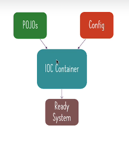
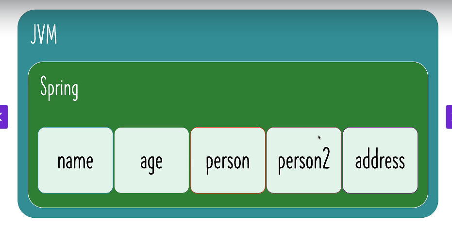
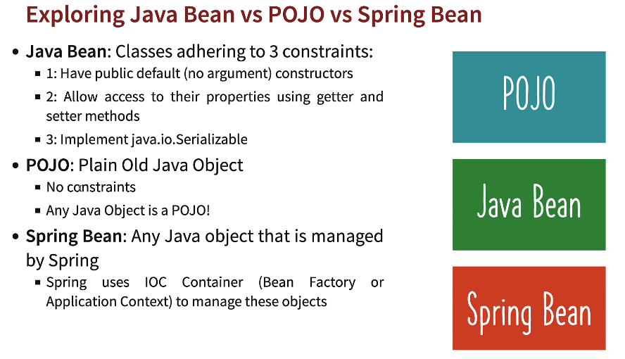

## What is Spring Container? aka:  Spring Context/IOC Container
Spring Container manage Spring Beans & their lifecycle

**Spring container is responsible for managing the lifecycle of Spring beans, including creation, configuration, and  destruction.** when no longer needed. This management allows your application to leverage dependency injection efficiently, helping you maintain clean and modular code.

**POJOs (Java Classes)**(Plain old java object)
any class which we create automatically become POJO
record Person(String name, int age,Address address){ }
record Address(String firsLine, String City, String Postal){}

**Congif**
@Configuration
public class HelloWorldConfiguration {}

### Ready System -> out put of IOC Container

**JavaBean** (not used in market)
1. public no argument constructor
2. getter and setter
3. implements Serializable

**SpringBeans**: anything manage by Spring framework

